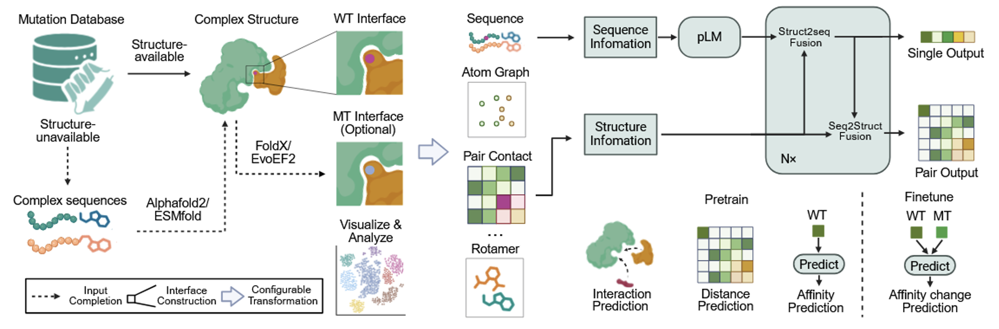
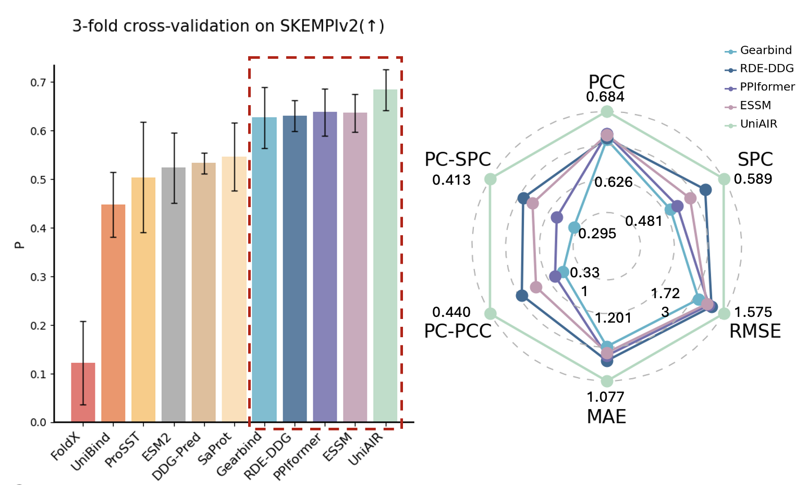

# Generalizable mutation-effect prediction across adaptive immune recognition via unified multimodal framework
The official repository of UniAIR (for review)
<p align="left">
  <a href="https://pytorch.org/">
    
  </a>
  <a href="https://lightning.ai/">
    
  </a>
  <a href="https://mamba.readthedocs.io/en/latest/">
    
  </a>
  <a href="https://huggingface.co/">
    
  </a>
</p>

## Overview
This repository contains the scripts of our architecture, and here is the way to run them.



UniAIR is a modular, multimodal framework for accurate and generalizable prediction of mutation effects across immune recognition scenarios. UniAIR integrates a standardized data pipeline, an interface-centric sequence–structure fusion transformer (S-Former) that integrates evolutionary information with geometric representations, and a suite of extensions for multi-expert consensus and adaptation to predicted structure inputs. UniAIR can be conducted to predict mutation effects in multiple scenarios, including antibody maturation, antigen escape, TCR–pHLA optimization and other tasks in adaptive immunology.

Please do not hesitate to contact us or create an issue/PR if you have any questions or suggestions!

## 🛠️ Installation

**Step 1**. Clone this repository and setup the environment. We recommend you to install the dependencies via the fast package management tool [mamba](https://mamba.readthedocs.io/en/latest/mamba-installation.html) (you can also replace the command 'mamba' with 'conda' to install them). Generally, UniAIR works with Python 3.11.5 and PyTorch version 2.0.1.
```
git clone git@github.com:hanrthu/UniAIR.git
cd UniAIR
mamba env create -f environment.yml
```

In order to run ESM2, ESMfold and Openfold, please also install the necessary packages via [fair-esm](https://github.com/facebookresearch/esm).

**Step 2**. Install flash-attn, you may also need to download some pretrained model weights and put them into ./trained_models/ folder.
```
# Download flash-attn-2.6.3 wheel file at https://github.com/Dao-AILab/flash-attention/releases/download/v2.6.3/flash_attn-2.6.3+cu118torch2.0cxx11abiFALSE-cp311-cp311-linux_x86_64.whl
pip install flash_attn-2.6.3+cu118torch2.0cxx11abiFALSE-cp311-cp311-linux_x86_64.whl
```
For the other three experts, we recommend to place their pretrained encoders as follows:
```
trained_models
├── gearbind
│   └── gearbind.pth
├── ppiformer
│   ├── classifier.pt
│   └── encoder.pt
├── RDE
│   └── RDE.pt
```


## 📖 Datasets and model weights for mutation effect on binding affinity prediction

### Dataset preprocessing
In UniAIR, the datasets are processed and splitted into standardized format, including the headers as follows:
| Protein | Partners(A_B) | mutation | pdb_id | DDG | chainids | valid_chains | path_wt | path_mut | fold_0 | fold_1 | fold_2 |
| :---: | :---: | :---: | :---: | :---: | :---: | :---: | :---: | :---: | :---: | :---: | :---: |

For different dataset, some of the headers are optional, and we also provide the above datasets' information in ./datasets folder.

For ESSM pretraining, the datasets are processed into the following format:
| Protein | Partners(A_B) | pdb_id | chainids | valid_chains | path | dG | fold_0 |
| :---: | :---: | :---: | :---: | :---: | :---: | :---: | :---: |


For each dataset, their structure are as follows:
```
dataset_name
├── labels
│   ├── xxx.csv
├── PDBs
│   ├── xxx.pdb/.cif
├── PDBs_mt
│   ├── xxx.pdb/.cif
├── splits
│   ├── dataset_name.csv
preprocess.py
```

The mutant structure can be generated from make_input() function. Place [EvoEF2](https://github.com/tommyhuangthu/EvoEF2) at ./models/folding/EvoEF2/ and run preprocess.py to generate mutant structures.

The wild type structure can be generated via ESMfold/Openfold, we provide a ESMfold prediction demo at ./models/folding/ESMfold/ESMfold_pred.py, and the users can modify preprocess.py to generate wild type structures.

We provide the raw and processed datasets for UniAIR, and they can be easily accessed through 🤗Huggingface: [/Jesse7/UniAIR_data](https://huggingface.co/datasets/Jesse7/UniAIR_data/tree/main). Download the corresponding datasets and place them at `./datasets` folder. **We are progressively uploading the datasets in one week since 02/25/2026.**

The number of samples of the original dataset is shown below:

| Type | Dataset | Label | Entries | Structures |
| :---: | :---: | :---: | :---: | :---: |
| Pretrain | SAbDab | - | 14850 | 7749 |
| Pretrain | STCRDab | - | 452 | 283 |
| Pretrain | PPB-Affinity | ∆G | 2683 | 2683 |
| Evaluation | SKEMPIv2 | ∆∆G | 5749 | 340 |
| Evaluation | TCRen bench 1 | Binary | 137137 | 137 |
| Downstream | HER2 | ∆∆G | 419 | 1 |
| Downstream | TCR-pMHC Atlas | ∆∆G | 87 | 39 |
| Downstream | LASSA-25.10C | Escape | 9491 | 1 |
| Downstream | LASSA-12.1F | Escape | 9473 | 1 |
| Downstream | LASSA-37.7H | Escape | 9701 | 1 |
| Downstream | LASSA-8.9F | Escape | 9694 | 1 |
| Downstream | SARS-CoV-2 | IC<sub>50</sub> | 7/3/8/1 | 1 |
| Downstream | TCR-pHLA unsupervised | - | 86 | 86 |
| Downstream | KRAS | ∆∆G | - | 1 |


## 🚀 Evaluation on the SKEMPIv2 datasets
The performance of 3-fold cross validation on UniAIR reaches state-of-the-art, and here is the comparison:


There are 6 options in this framework, including train, test, dms, transfer, transfer_test and pretune, each for different usage of UniAIR.
### Run cross-validation training of a single model on SKEMPIv2
Training a single model, for example, ESSM.
```
python run.py train --model_config ./config/models/train/ESSM.yaml --data_config ./config/datasets/wo_mutant/SKEMPIv2.yaml --run_config ./config/runs/train_basic.yaml                  
```
We support multiple models in this framework, including ESSM, RDE, PPIformer, Gearbind, DDGPred, UniBind, ESM2, please refer to ./configs for their configuration. If you want to train another single expert, replace the --model_config parameter. If training models that require mutant structures, replace --data_config by ./config/datasets/with_mutant/SKEMPIv2.yaml.

### Run 3-fold test on SKEMPIv2
```
python run.py test --model_config ./config/models/train/UniAIR.yaml --data_config ./config/datasets/with_mutant/SKEMPIv2.yaml --run_config ./config/runs/test_basic.yaml
```

We also provide three-fold experts trained with SKEMPIv2, and they can be downloaded through 🤗Huggingface: [/Jesse7/UniAIR](https://huggingface.co/Jesse7/UniAIR). Download these weights at place them at `./expert_ckpts` folder. Then, you can train MoFPE to combine experts.

We recommend to download the trained experts and place them as follows:
```
expert_ckpts
├── essm
│   ├── essm_fold0.ckpt
│   ├── essm_fold1.ckpt
│   └── essm_fold2.ckpt
├── gearbind
│   ├── gearbind_fold0.ckpt
│   ├── gearbind_fold1.ckpt
│   └── gearbind_fold2.ckpt
├── ppiformer
│   ├── ppiformer_fold0.ckpt
│   ├── ppiformer_fold1.ckpt
│   └── ppiformer_fold2.ckpt
└── rde
    ├── rde_fold0.ckpt
    ├── rde_fold1.ckpt
    └── rde_fold2.ckpt
```

For each model, we have the same raw data preprocessing and model-specific pretransform. For detail, please refer to ./data/transforms/{model_name}.py

### Run cross-validation training of UniAIR on SKEMPIv2.
```
python run.py train --model_config ./config/models/train/UniAIR.yaml --data_config ./config/datasets/with_mutant/SKEMPIv2.yaml --run_config ./config/runs/train_basic.yaml                  
```

### Run binary prediction of TCR-pMHC binding specificity
```
python run.py test --model_config ./config/models/train/UniAIR.yaml --data_config ./config/datasets/with_mutant/SKEMPIv2.yaml --run_config ./config/runs/train_basic.yaml                  
```


## 🚀 Downstream applications for different tasks

### Zero-shot mutation scanning on TCR-pMHC structures (with a three-expert UniAIR variant to speed up)
### Option 1: via standard preprocessing and testing on xxx.csv
```
python run.py test --model_config ./config/models/train/UniAIR_meanens.yaml --data_config ./config/datasets/wo_mutant/TCR-MHC_unsup.yaml
```
### Option 2: via dms function directly (can select the chain and periods for the scanning)

```
python run.py dms --data_config ./config/datasets/downstream/dms.yaml --run_config ./config/runs/dms_basic.yaml --input_dir ./datasets/DMS/LASSA/PDBs/7tyv_part_2510C.pdb --chain A --valid_chains A,a,D,E --partners Aa_DE --period "10,20;40,45"
```

### Few-shot learning for escape prediction
```
python run.py train --model_config ./config/models/train/ESSM.yaml --data_config ./config/datasets/wo_mutant/LASSA_89F_0.1train.yaml --run_config ./config/runs/train_basic.yaml                  
```

### UniAIR-LT training on SKEMPIv2
```
python run.py transfer --model_config ./config/models/transfer/adapter.yaml --data_config ./datasets/transfer/SKEMPIv2_esm.yaml --run_config ./runs/transfer_basic.yaml
```


